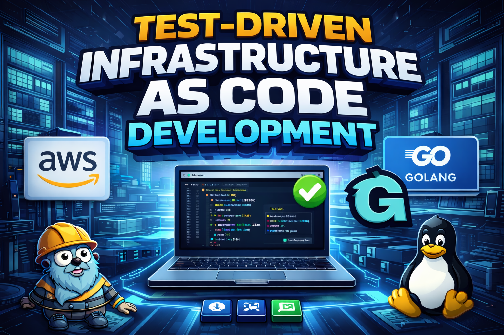

<!-- 

# Test Driven infrastructure as code development -->

<p align="center">
  
</p>

<h1 align="center">Test-Driven Infrastructure as Code Development</h1>

<p align="center">
Validate and manage infrastructure in small deployable units
</p>

## Contents

1. [Preface](#preface)
    1. [Key background information](#key-background-information)
    2. [Infrastructure as code development has it's own lifecycle](#infrastructure-as-code-development-has-its-own-lifecycle)


2. [Start of Tutorial! Hello, World!](#start-of-tutorial-hello-world)

# Preface

Delpoying cloud infrastructure for a lot of businesses is not a smooth process. Writing terraform code for AWS resources can start off well but become difficult once more complex requirements become a part of the project. Through this tutorial, you'll understand a workflow that can help greatly. The tools are opensource and developed by [gruntwork.io](https://www.gruntwork.io/)

Using this workflow, we'll show readers how to create a global cloud infrastructure in a solid, reliable fashion. And it'll be more enjoyable to build!

<!-- Welcome to this series of blog posts! The series will outline a workflow you can use to develop infrastructure as code configurations that are both testable and DRY. Along the way we'll discuss the current state of Devops/Platform Engineering, both for the people who build solutions and the customers who use them! 

We'll be building AWS ECS Clusters using some excellent tools created by gruntworks. They'll be deployed in multiple AWS accounts and regions. All the code will be available HERE::::: -->


## Prerequisites

TODO: MISE

- OpenTofu v1.11.2
- Go v1.24.
- Terragrunt v0.97.2 
- Terratest v0.54.0
- An AWS organization with child accounts that you have programmatic access to from your local machine

## Key background information
The suggested workflow is an addition to the work already done in the following resources: 

- [Automated Testing for Terraform, Docker, Packer, Kubernetes, and More (by Yevgeniy Brikman)](https://www.infoq.com/presentations/automated-testing-terraform-docker-packer/)
- [Gruntwork: Terragrunt — How to Keep Your Terraform Code DRY and Maintainable (by gruntwork.io)](https://terragrunt.gruntwork.io/docs/guides/terralith-to-terragrunt/)  
- [Learn Go with Tests (by Chris James)](https://quii.gitbook.io/learn-go-with-tests/go-fundamentals/hello-world)
- [Terragrunt Tutorial: Create VPC, EKS from Scratch! (YouTube, by Anton Putra)](https://www.youtube.com/watch?v=yduHaOj3XMg)

All credit to the creators of those resources

## How can we test our infrastructure as code? 

You can find a lot about the testing concepts we'll be using from the following link:
- [Automated Testing for Terraform, Docker, Packer, Kubernetes, and More by Yevgeniy Brikman](https://www.infoq.com/presentations/automated-testing-terraform-docker-packer/)

Here's the general options you have for testing code (and infra-as-code)

- Static Analysis
- Unit Tests 
- Integration Tests
- End-to-end tests

As developers progress through the workflow, they can take advantage of all these test options.

## Infrastructure as code development has it's own lifecycle

Infrastructure as code is the practice of defining your cloud infrastructure as with a programming language and using it to deploy your infrastructure. To effectively test this code, it's required that you actually provision the resources. As your infrastructure becomes more complex, the time take to do this will increase significantly. That's what is meant by IaC having it's own development lifecycle.

The only way to confirm a correct infrastructure for certain in our unit, integration and end-to-end tests is to actually deploy the infrastructure, interact with it in some way, then destroy it.

In short: 

*“deploy short-lived infra and assert expectations”*

This is more costly and time consuming that compiling go code and is a major conisderation in development of this kind.

# Static Analysis | v0.0.0

> **Note:** All our resources here are available in the corresponding tag of the [terragrunt-module-ecs-vpc repo](https://github.com/david-hankinson/terragrunt-module-vpc-ecs/)

Write a minimum configuration to do some static analysis: 

```
output "static_analysis_string" {
  value = "hello world"
}
```
Before we move onto terratest, there are some other tools we can use for testing our infrastructure as code. They apply to the ['shift left'](https://www.crowdstrike.com/en-us/cybersecurity-101/cloud-security/shift-left-security/) mentality and provide a solid basis on which to start.

You can complete static analysis on your code with: 

- **`tofu fmt`** formats OpenTofu configuration files into a consistent, canonical style

- **`tofu validate`** checks that the configuration is syntactically and structurally valid without contacting providers or making changes.

- **`tofu plan`** evaluates the current configuration and state to produce an execution plan showing what changes OpenTofu would make if applied, without making any actual changes.

```text
> tofu fmt

> tofu plan

Changes to Outputs:
  + static_analysis_string = "hello world"

You can apply this plan to save these new output values to the OpenTofu state, without changing any real infrastructure.


Note: You didn't use the -out option to save this plan, so OpenTofu can't guarantee to take exactly these actions if you run "tofu apply" now.


> tofu validate
Success! The configuration is valid.
```

# v0.0.1

> **Note:** [AWS VPC's](https://docs.aws.amazon.com/vpc/) are not — and in most cases cannot — treated as short lived cloud resources that you spin up and tear down. They’re generally long-lived resources you keep around for a while. This can be taken into account when writing your test suite.

Chris James in his learn go with tests book defines a development lifecycle as follows: 

1. Write a test

2. Make the compiler pass

3. Run the test, see that it fails and check the error message is meaningful

4. Write enough code to make the test pass

5. Refactor

In our case, we follow this as a general pattern as long as it's practical. Validating and managing cloud resources is not the same as compiling go code. Rather than being stored in memory, the resources our code defines will be on AWS infrastructure and will for the most part have a cost. That is something anyone deploying cloud infra should/will be very aware of. 

<!-- In our case, we aren't testing go code. We're testing terraform code. Which is in turn provisioning AWS (or other types of...) resources. That means we'll have to use this as a guide and deal with each type of resource being provisioned as it comes along. This at times can become difficult and a big challenge, that is the life of an infrastructure developer. -->

## One last step before we write some Go! Best Practices for writing Terratests
The terragrunt documentation give good information on best practices when running tests on your terragrunt code.

https://terratest.gruntwork.io/docs/testing-best-practices/timeouts-and-logging/

https://terratest.gruntwork.io/docs/testing-best-practices/avoid-test-caching/

So setup your test environment by running: `go test -count=1 -timeout 30m -p 1 ./...`

You'll need to set your timeout based on your own requirements. 

In the style of the learn go with tests book, we'll start by writing a test and check the results of its run.

In this repo's /test folder, I have my development machine set to the profile of only one of my child accounts run a `go mod init <module-name>`, then run `go mod tidy` and a `go test` to run the test and watch it fail.

This test only confirms that the terraform code plan executes successfully. A good place to establish a unit test and build on further.

✅ **Important:** When running this code, your **state file will be saved locally** until we progress to using s3 backends.

```
package test

import (
    "testing"

    "github.com/gruntwork-io/terratest/modules/terraform"
)

func TestPlanSucceeds(t *testing.T) {
    t.Parallel()

    opts := &terraform.Options{
        TerraformDir:    "../module",
        TerraformBinary: "tofu", 
    }

    terraform.Init(t, opts)
    terraform.Plan(t, opts) 
}
```
At the time of writing, when running the `go mod tidy` I got the following error:
```
go: test tested by
        test.test imports
        github.com/gruntwork-io/terratest/modules/terraform: ambiguous import: found package github.com/gruntwork-io/terratest/modules/terraform in multiple modules:
        github.com/gruntwork-io/terratest v0.46.16 (/home/david/go/pkg/mod/github.com/gruntwork-io/terratest@v0.46.16/modules/terraform)
        github.com/gruntwork-io/terratest/modules/terraform v0.0.0-20251107042628-de08859c6b2d (/home/david/go/pkg/mod/github.com/gruntwork-io/terratest/modules/terraform@v0.0.0-20251107042628-de08859c6b2d)
```
When running the `go mod init` <NAME> and `go mod tidy`, we created 2 files, a go.mod and go.sum

Edit the go.mod file to include the following:

```
require (
    github.com/gruntwork-io/terratest v0.54.0
    github.com/stretchr/testify v1.10.0
)
```

This specifies the version of terratest required and resolves the ambiguous import.

Ok, so we now need some resources to test! As you can see, in v0.0.1, the main.tofu file was commented out. So we're going to uncomment it and take the next step fowards into v0.0.2

Show the slide with the different types of test on it - static, unit, integration and so on

# v0.0.2

Lets start with a bare bones AWS VPC that will hopefully fulfill the criteria outlined in our first test.

If you have written any infrastructure as code, there's a reasonable chance that you started off with something like this. One file with provider information, a flat structure and hardcoded resources. 

It's not our final destination, but it's ok to start with. 

```
resource "aws_vpc" "this" {
   cidr_block = "<YOUR CIDR BLOCK HERE>"

   enable_dns_hostnames = true
   enable_dns_support   = true

   // enable a vpc endpoint for s3 and private subnets

   tags = {
     name = "dev-vpc"
   }
}

resource "aws_subnet" "public" {
   count = 2

   vpc_id                  = aws_vpc.this.id
   availability_zones   = ["<YOUR AZ HERE>", "<YOUR AZ HERE>"]
   cidr_block           = "YOUR CIDR BLOCK HERE"
   map_public_ip_on_launch = true

   tags = {
     Name = "public-subnet"
   }
}

resource "aws_subnet" "private" {
   count = 2

   vpc_id            = aws_vpc.this.id
   availability_zones   = ["<YOUR AZ HERE>", "<YOUR AZ HERE>"]
   cidr_block           = "YOUR CIDR BLOCK HERE"
   #map_public_ip_on_launch = false

   tags = {
     Name = "private-subnet"
   }
}

```
Run the tests again and they'll pass!

```
TestPlanSucceeds 2026-01-04T17:40:22-07:00 logger.go:67: guarantee to take exactly these actions if you run "tofu apply" now.
PASS
ok      test    46.542s
```

Ok, excellent! We're writing test driven infrastructure as code!

# v0.0.3

Currently, our code deploys resources into one aws account, in one region. Many large businesses need to harness AWS's global reach to best serve their customers. The first step will be to modularise the configuaration, then to make use of [Terragrunt by gruntworks](https://terragrunt.gruntwork.io/). 

Additionally, modular Terragrunt code allows our devops teams to build small, reusable units of infrastructure with *company best practices baked in*.

To turn this into an analogy, it's simillar to having 1000 houses to build, and 100 different crews to build them. Left to their own devices, they'd all build them differently. And some of the crews haven't been building houses for long and would benefit from help! 

With terragrunt, we're able to much more easily provide a central location that can produce pre-fabricated walls, ceilings, floors and roofs. These are our modules of infrastructure-as-code! They form the building blocks of the business' cloud estate. 

We're able to build structures that can support a strong business. Teams can deploy more regularly, safely and in small, incremental steps.

## Background reading

- [Terragrunt units](https://terragrunt.gruntwork.io/docs/features/units/)
- [Terragrunt stacks](https://terragrunt.gruntwork.io/docs/features/stacks/)

We can now update our tofu code and give it the structure of the module without changing any of the resources it defines. 

First, create an 'infrastructure-live' folder 

As a first step, we'll point our infrastructure live to our modules folder and pass inputs from the infrastructure live folder to the module code. This will allow us to avoid repeating ourselves too much. 

We'll end up with a folder structure that looks like this:

```
infrastructure-live
  - non-prod
    - vpc
      - main.tofu
      - outputs.tofu
  - prod 
    - vpc
      - main.tofu
      - outputs.tofu

modules
  - vpc
    - 00-vpc.tofu
```

You can also additionally break the vpc code down into multiple files, a vpc, subnet, outputs and variables file.

```

```


# v0.0.4 


There's been some static analysis and a written terratest that essentially performs one type of static analysis on our code with a tofu plan. We can now start to define more features in a test-driven manner.

```
package test

import (
	"fmt"
	"testing"
	"time"

	"github.com/gruntwork-io/terratest/modules/aws"
	"github.com/gruntwork-io/terratest/modules/retry"
	"github.com/gruntwork-io/terratest/modules/terraform"
	"github.com/stretchr/testify/assert"
	"github.com/stretchr/testify/require"
)

func TestVpcAndSubnets(t *testing.T) {
	t.Parallel()

	opts := &terraform.Options{
		TerraformDir:    "../non-prod/vpc",
		TerraformBinary: "tofu",
	}

	defer terraform.Destroy(t, opts)
	terraform.InitAndApply(t, opts)

	vpcID := terraform.Output(t, opts, "vpc_id")
	pubIDs := terraform.OutputList(t, opts, "public_subnets_ids")
	privIDs := terraform.OutputList(t, opts, "private_subnets_ids")
	fmt.Printf("Provisioned VPC Name: %s\n", vpcID)
	fmt.Printf("Provisioned pubIDs: %s\n", pubIDs)
	fmt.Printf("Provisioned privIDs: %s\n", privIDs)

	// type Vpc struct {
	// 	Id                   string            // The ID of the VPC
	// 	Name                 string Test Variables: These are defined in your terraform.Options struct within the Vars or VarFiles attributes.           // The name of the VPC
	// 	Subnets              []Subnet          // A list of subnets in the VPC
	// 	Tags                 map[string]string // The tags associated with the VPC
	// 	CidrBlock            *string           // The primary IPv4 CIDR block for the VPC.
	// 	CidrAssociations     []*string         // Information about the IPv4 CIDR blocks associated with the VPC.
	// 	Ipv6CidrAssociations []*string         // Information about the IPv6 CIDR blocks associated with the VPC.
	// }

	var vpc *aws.Vpc

	retry.DoWithRetry(t, "Wait for VPC to be discoverable", 100, 15*time.Second, func() (string, error) {
		var err error
		vpc, err = aws.GetVpcByIdE(t, vpcID, "ca-central-1")
		if err != nil {
			return "", err
		}
		return "VPC found", nil
	})

	assert.Equal(t, vpcID, vpc.Id)
	assert.Equal(t, "10.50.0.0/16", *vpc.CidrBlock)
	require.Len(t, vpc.Subnets, 4)

	// // “public + private subnets exist” tests in the outputs
	require.Len(t, pubIDs, 2)
	require.Len(t, privIDs, 2)

	// use the terratest aws module to confirm 4 subnets are present in the aws account
	require.Len(t, vpc.Subnets, 4)
}
```

Here, we're carrying out a more 'unit test' type of test on the VPC. Firstly, collecting the outputs and storing them in memory, and later calling AWS api's to confirm that the values the VPC is displaying match our outptuts. Addtionally, we're confirming the number of subnets in total, as well is private and public subnets, match what we're looking for. 


ALL TESTS MUST BE: 
RUN IN A SANDBOX ENVIRONMENT? 
WE WON'T BE TESTING AT THE MULTI-ACCOUNT LEVEL
AND WHEN REQUIRED RUN IN PARRALLEL